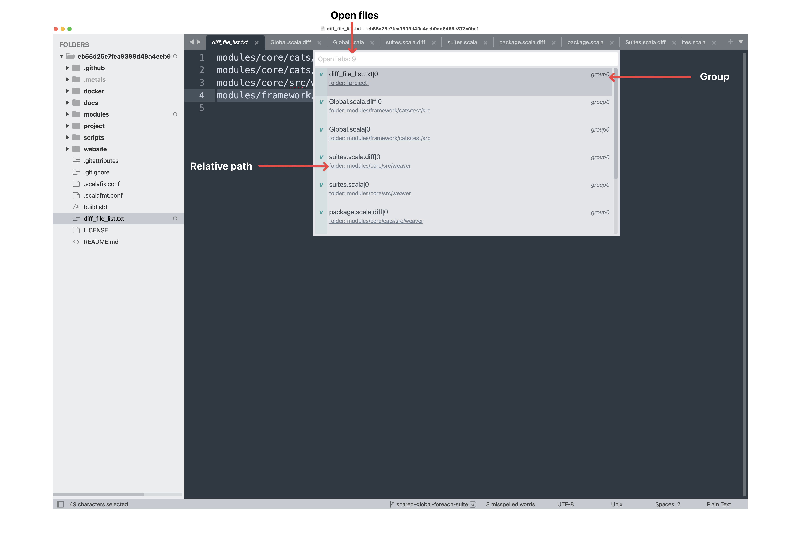
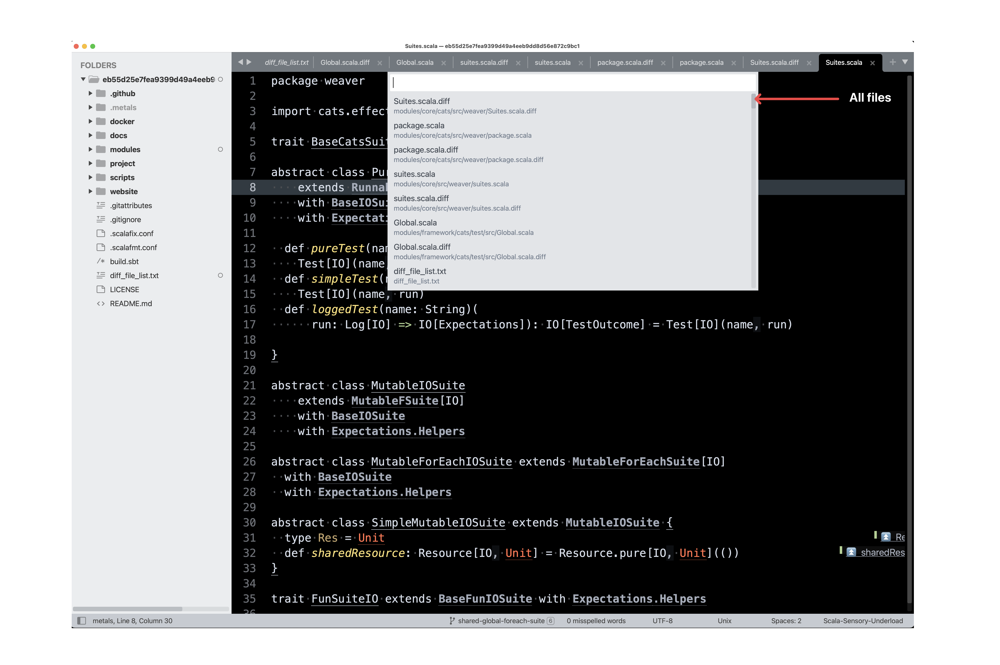
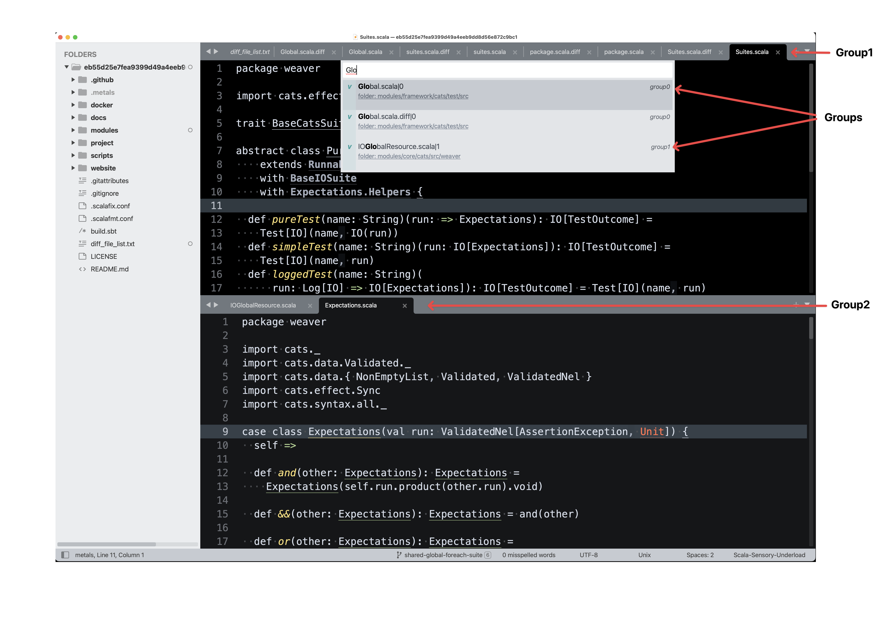
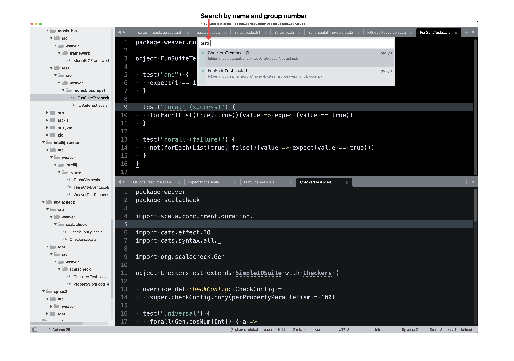

# OpenTabs

[Sublime Text](https://www.sublimetext.com/) plugin to search open files.



## Installation

- Open the command palette with `CMD + SHIT + P`
- Select `Package Control: Add Repository`
- Enter https://github.com/ssanj/OpenTabs for the repository
- Select `Package Control: Install Package`
- Choose OpenTabs


## Functionality


In the standard Sublime Text `Goto Anything` panel you get a list every file your in your project directory by default. On large projects this can be overwhelming.



Sometimes you just want to quickly jump between just the files you have open.

### Search Open Files

To open a list of open files  press `CMD + T`.




### Search Open Files by Group

You can also search by name and group using the `|GROUP_NUMBER` syntax.

For example to search for files matching `test` in group1 you would enter:

```
test|1
```



### Long Paths are truncated with Hints

Sometimes when the relative path to a file is too long it can get truncated by the quick list. OpenTabs allows you to customise at what length the path should be truncated and also shows a hint as to the path elements that might be truncated.


#### Settings

There are two settings that control this behaviour:

`truncation_line_length` specifies after how many characters the path should be truncated. A truncated path will be elided with ellipses.

`truncation_preview_length` specifies how many characters from the __end__ of the path should be shown as a hint if the path is truncated.

